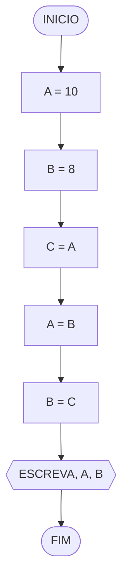
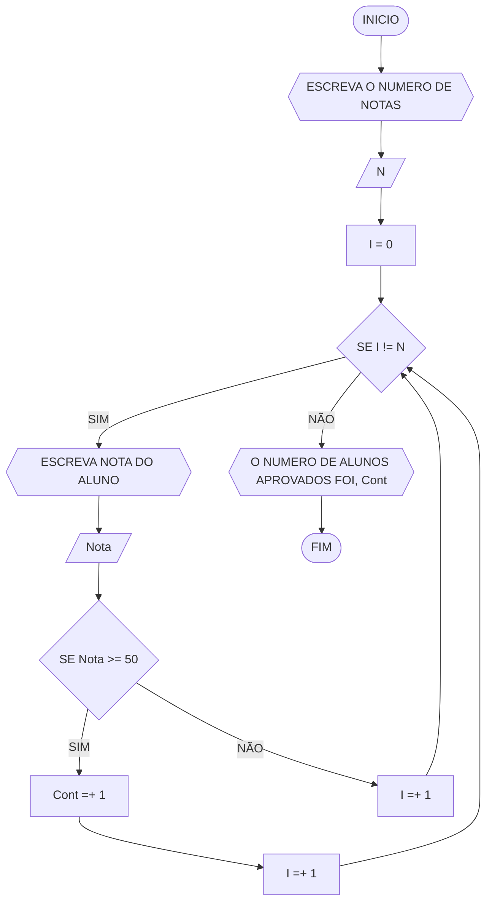
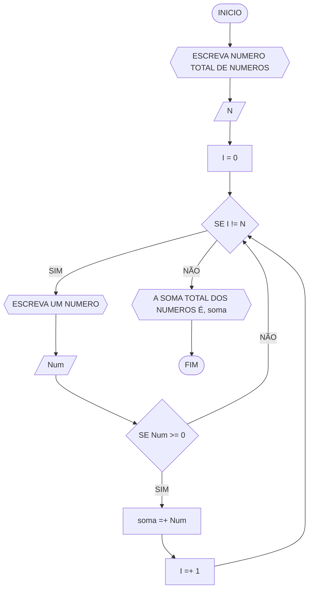
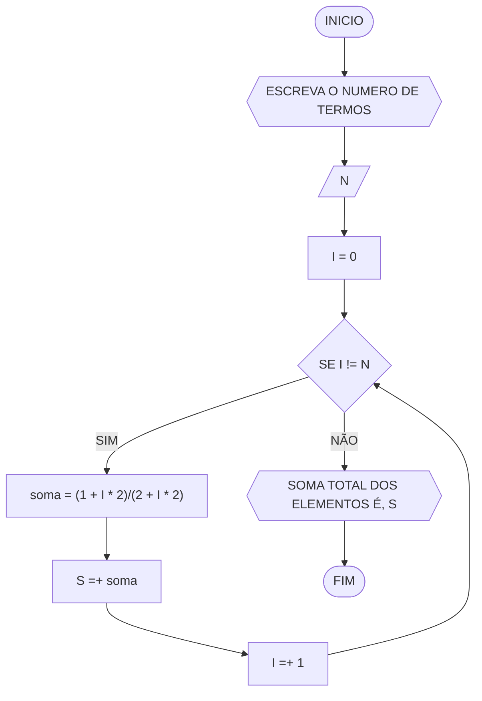
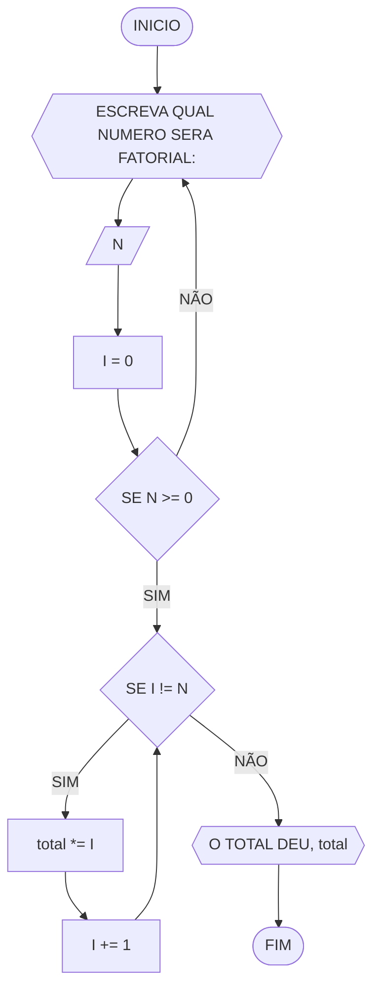
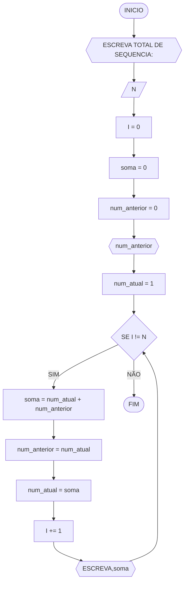
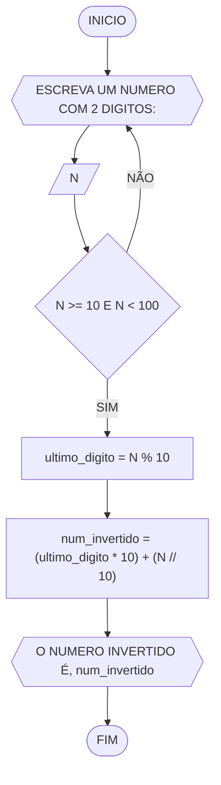

## Lista de questões

### Questão 1 - Troca dos valores de duas variáveis (1 ponto)

Dadas duas variáveis, $a$ e $b$, implemente e teste um algoritmo para trocar os valores atribuídos a elas.
#### Fluxograma (0.25 ponto)



#### Pseudocódigo (0.5 ponto)

```
Algoritmo TrocaValores
DECLARE A, B, C: REAIS
ESCREVA A, B
A = 10
B = 8
C = A
A = B
B = C
ESCREVA A, B
FIM_ALGORITMO
```

#### Teste de mesa (0.25 ponto)

| nome_coluna1 | nome_coluna2 | nome_coluna3 | nome_coluna4 | nome_coluna5 | 
|      --      |      --      |      --      |      --      |      --      | 
| Adicione     | espaço       | se quiser    |  alinhar     | as barras    |   
| verticais,   | mas          | não é        | obrigatório. | Entendido ?  |

### Questão 2 - Contagem (1 ponto)

Dado um conjunto $n$ de notas de alunos em um exame, implemente e teste um algoritmo para fazer uma contagem $cont$ do número de alunos que foram aprovados no exame. 
Será considerado aprovado o aluno que tirar $nota$ 50 ou maior (no intervalo de 0 a 100).

#### Fluxograma (0.25 ponto)




#### Pseudocódigo (0.5 ponto)

```
ALGORITMO ALUNOS_APROVADOS
DECLARE N, I, Cont, Nota : NUMERICO INTEIRO
INCIO
ESCREVA "DIGITE NUMERO DE NOTAS: "
LEIA N
I = 0
Cont = 0
ENQUANTO I != N FAÇA
	ESCREVA "DIGITE NOTA DO ALUNO"
	LEIA Nota
	SE NOTA >= 50
		Cont =+ 1
		I =+ 1
	SENÃO
		I =+ 1
FIM_ENQUANTO
ESCREVA "NUMERO DE ALUNOS APROVADO FOI ", Cont
FIM_ALGORITMO 

```


#### Teste de mesa (0.25 ponto)

| nome_coluna1 | nome_coluna2 | nome_coluna3 | nome_coluna4 | nome_coluna5 | 
|      --      |      --      |      --      |      --      |      --      | 
| Adicione     | espaço       | se quiser    |  alinhar     | as barras    |
| verticais,   | mas          | não é        | obrigatório. | Entendido ?  |

### Questão 3 - Soma de um conjunto de números (1 ponto)

Dado um conjunto de $n$ números, implemente e teste um algoritmo para calcular a soma desses números. <br>
Aceite apenas $n$ maior ou igual a zero.

#### Fluxograma (0.25 ponto)



#### Pseudocódigo (0.5 ponto)

```
ALGORITMO SOMA_TOTAL
DECLARE I, N, soma, Num: NUMERICO
INICIO
ESCREVA "DIGITE QUANTOS NUMERO SERA: "
LEIA N
I = 0
soma = 0
ENQUANTO I != N FAÇA
	ESCREVA "DIGITE UM NUMERO"
	LEIA Num
	SE Num >= 0
		soma =+ Num
		I =+ 1
FIM_ENQUANTO
ESCREVA "A SOMA TOTAL DOS NUMEROS É", soma
FIM_ALGORITMO

```

#### Teste de mesa (0.25 ponto)

| nome_coluna1 | nome_coluna2 | nome_coluna3 | nome_coluna4 | nome_coluna5 | 
|      --      |      --      |      --      |      --      |      --      | 
| Adicione     | espaço       | se quiser    |  alinhar     | as barras    |
| verticais,   | mas          | não é        | obrigatório. | Entendido ?  |

### Questão 4 - Cálculo de uma série (1 ponto)

Dado um conjunto de $n$ termos da série, implemente e teste um algoritmo para calcular o valor de S, conforme definido abaixo:

$$ S = \frac{1}{2} + \frac{3}{4} + \frac{5}{6} + \frac{7}{8} + \dots $$

#### Fluxograma (0.25 ponto)




#### Pseudocódigo (0.5 ponto)

```
ALGORITMO SOMA_DE_N_ELEMENTOS
DECLARE I, N, soma, S: NUMERICO INTEIRO
INCIO
ESCREVA" Digite quantos termos serâo: "
LEIA N
I = 0
soma = 1/2
ENQUANTO I != N FAÇA
	soma = (1 + I * 2)/(2 + I * 2)
	S =+ soma
	I =+ 1
FIM_ENQUANTO
ESCREVA "SOMA TOTAL DOS ELEMENTOS É ", S
FIM_ALGORITMO

```

#### Teste de mesa (0.25 ponto)

| nome_coluna1 | nome_coluna2 | nome_coluna3 | nome_coluna4 | nome_coluna5 | 
|      --      |      --      |      --      |      --      |      --      | 
| Adicione     | espaço       | se quiser    |  alinhar     | as barras    |
| verticais,   | mas          | não é        | obrigatório. | Entendido ?  |

### Questão 5 - Cálculo fatorial (2 pontos)

Dado um número $n$, implemente e teste um algoritmo para calcular o fatorial de $n$ (escrito como $n!$), onde $n ≥ 0$.

#### Fluxograma (0.5 ponto)



#### Pseudocódigo (1.0 ponto)

```
ALGORITMO NUMERO_FATORIAL
DECLARE N, I, TOTAL: NUMERICO INTEIRO
INCIO
I = 0
REPITA
	ESCREVA "ESCOLHA UM NUMERO POSITIVO: "
	LEIA N
ATE_QUE N >= 0
ENQUANTO I != 0 FAÇA
	TOTAL *= I
	I += 1
FIM_ENQUANTO
ESCREVA "TOTAL DEU ", TOTAL
FIM_ALGORITMO
```
#### Teste de mesa (0.5 ponto)

| nome_coluna1 | nome_coluna2 | nome_coluna3 | nome_coluna4 | nome_coluna5 | 
|      --      |      --      |      --      |      --      |      --      | 
| Adicione     | espaço       | se quiser    |  alinhar     | as barras    |
| verticais,   | mas          | não é        | obrigatório. | Entendido ?  |

### Questão 6 - Geração da sequência de Fibonacci (2 pontos)

Gerar e imprimir os $n$ primeiros termos da sequência de Fibonacci, onde $n ≥ 1$. <br>
Os primeiros termos são: $0, 1, 1, 2, 3, 5, 8, 13, \dots$ <br>
Cada termo, além dos dois primeiros, é derivado da soma dos seus dois antecessores mais próximos.

#### Fluxograma (0.5 ponto)




#### Pseudocódigo (1.0 ponto)

```
ALGORITMO_FIBONACCI
DECLARE I, N, num_anterior, num_atual, soma: numerico inteiro
INICIO
ESCREVA "digite o numero de termos: "
LEIA N
num_anterior = 0
num_atual = 1
i = 0
ESCREVA num_anterior
ENQUANTO I != N FAÇA
	soma = num_atual + num_anterior
	num_anterior = num_atual
	num_atual = soma
	i += 1
	ESCREVA soma
FIM_ENQUANTO
FIM_ALGORITMO
```

#### Teste de mesa (0.5 ponto)

| nome_coluna1 | nome_coluna2 | nome_coluna3 | nome_coluna4 | nome_coluna5 | 
|      --      |      --      |      --      |      --      |      --      | 
| Adicione     | espaço       | se quiser    |  alinhar     | as barras    |
| verticais,   | mas          | não é        | obrigatório. | Entendido ?  |

### Questão 7 - Inversão dos dígitos de um número inteiro (2 pontos)

Implemente e teste um algoritmo para inverter a ordem dos dígitos de um número inteiro positivo de dois dígitos.

#### Fluxograma (0.5 ponto)





#### Pseudocódigo (1.0 ponto)

```
ALGORITMO_INVERSÃO_DE_NUMERO
DECLARE N, ultimo_digito, num_invertido: numerico inteiro
INICIO
REPITA
	ESCREVA "DIGITE UM NUMERO COM 2 DIGITOS: "
	LEIA N
ATE_QUE N >= 10 E N < 100
ultimo_digito = N % 10
num_invertido = (ultimo digito * 10) + (N // 10)
ESCREVA "O NUMERO INVERTIDO DE ", N, "É ",num_invertido
FIM_ALGORITMO
```
#### Teste de mesa (0.5 ponto)

| nome_coluna1 | nome_coluna2 | nome_coluna3 | nome_coluna4 | nome_coluna5 | 
|      --      |      --      |      --      |      --      |      --      | 
| Adicione     | espaço       | se quiser    |  alinhar     | as barras    |
| verticais,   | mas          | não é        | obrigatório. | Entendido ?  |
