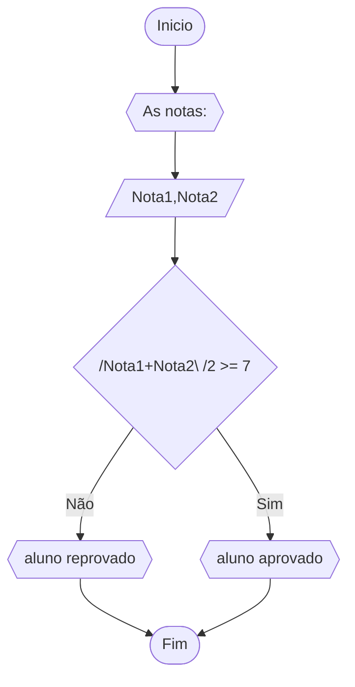
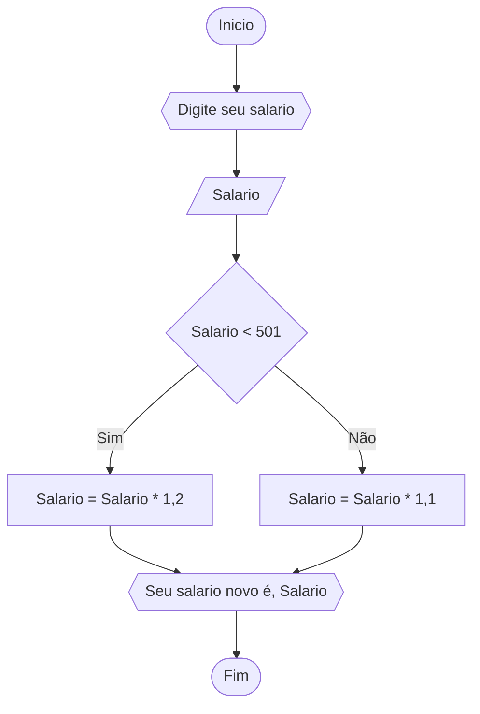
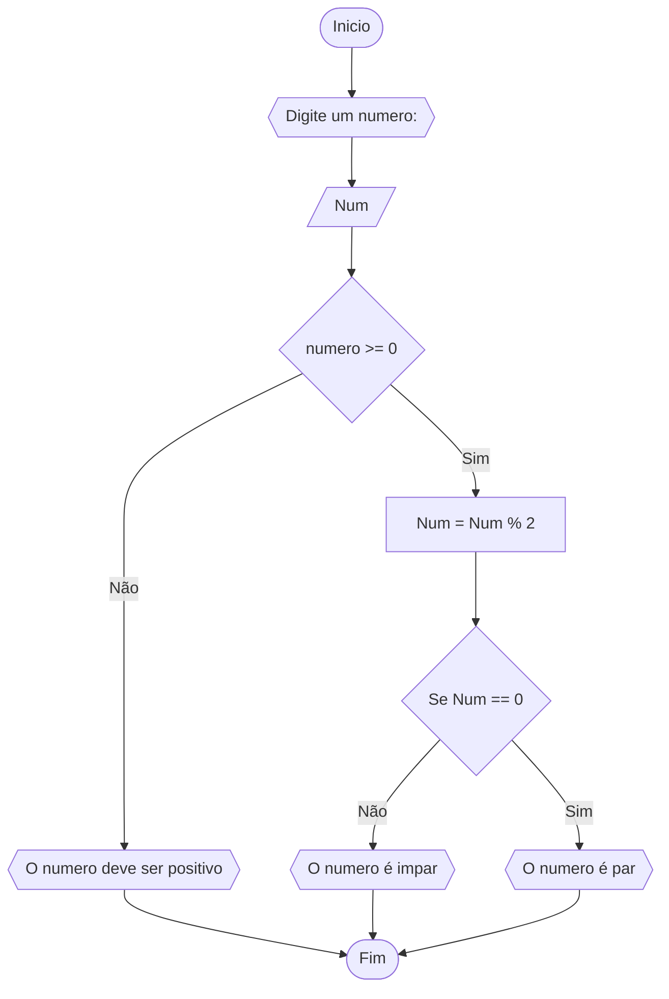
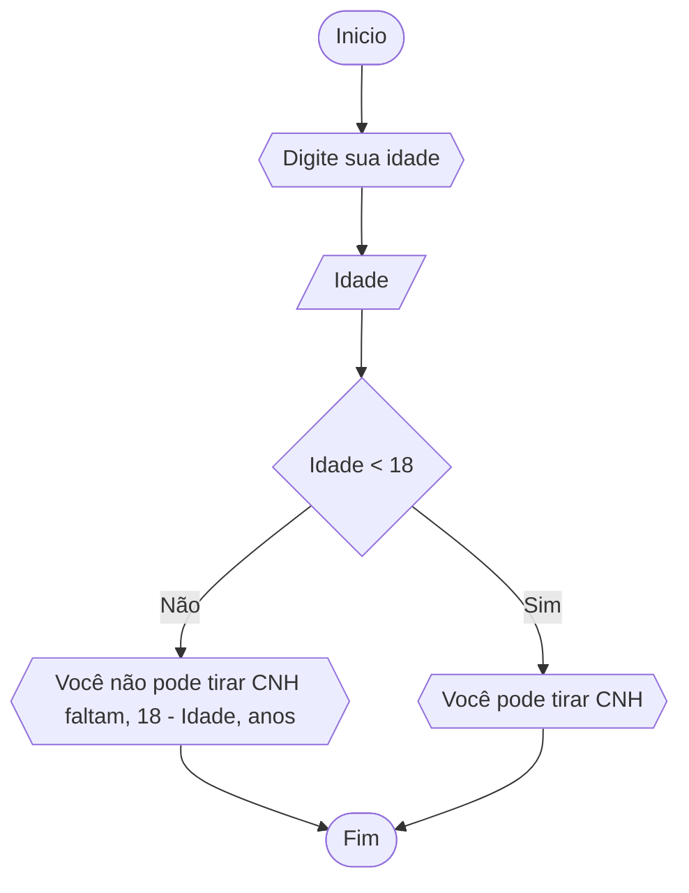

# UNIFOR
**Disciplina:** Raciocínio Logico Algorítmico
**Orientador:** Ricardo
## Lista de exercícios
### Questão 1


```
1 Algoritmo Aprovado_Reprovado
2 Declare nota1, nota 2, numerico
3 ESCREVA "digite as notas"
4 Leia nota1, nota2
5 SE (nota1+nota2)/2 >= 7
6 	ENTÃO ESCREVA "aluno aprovado"
7 SENÂO
8 	ESCREVA "aluno reprovado"
```


### Questão 2


```
1 Algoritmo Novo_Salario
2 Declare salario, numerico
3 ESCREVA "digite seu salario: "
4 Leia salario
5 SE salario < 501
6 	ENTÂO salario = salario * 1,2
7 SENÂO
8 	salario = salario * 1,1
9 ESCREVA "Seu novo salario é", salario

```

### Questão 3
Represente, em fluxograma e pseudocódigo, um algoritmo para determinar se um numero é par ou impar -- numero inteiro e positivo par ou impar--

### FLUXOGRAMA


```
1	ALGORITIMO verificar_par_impar
2	DECLARE Num, resto numerico
3	ESCREVA "Digite um numero: "
4	Leia Num
5		SE numero > 0 ENTÃO
6		resto = num % 2
7		SE resto == 0 
8			ESCREVA "numero par"
9		SENAO
10			ESCREVA "numero impar"
11	SENÂO 
12		ESCREVA "numero deve ser positivo"
13	FIM_ALGORITMO

```

### Questão 4



```
1 Algoritmo CNH
2 Declare Idade, numerico
3 ESCREVA "digite sua idade: "
4 Leia idade
5 SE idade < 18
6 	ENTÂO Escreva "Voce não pode tirar CNH falta", 18 - idade, "anos"
7 SENÂO
8 	Escreva "Voce pode tirar CNH"


```
