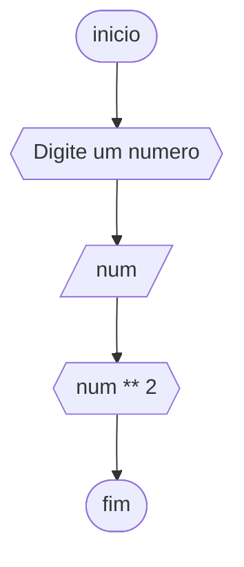
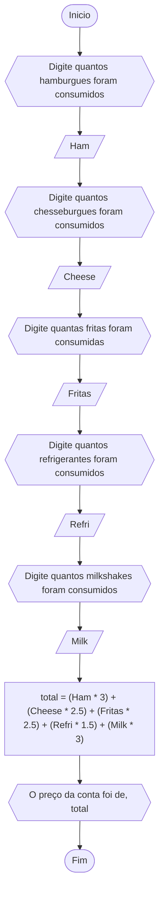
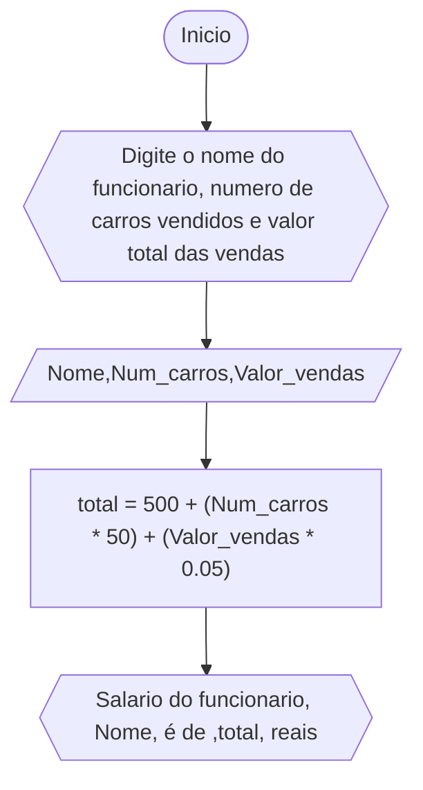
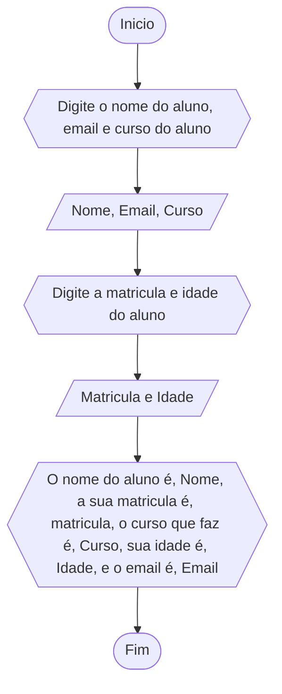
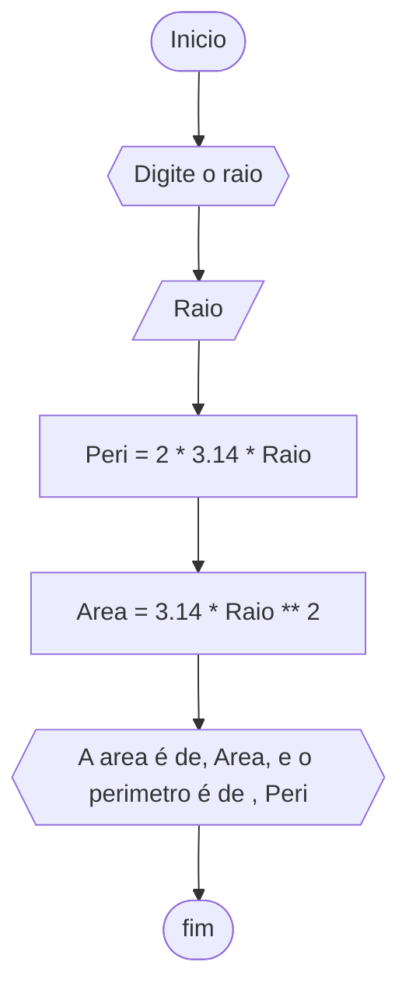
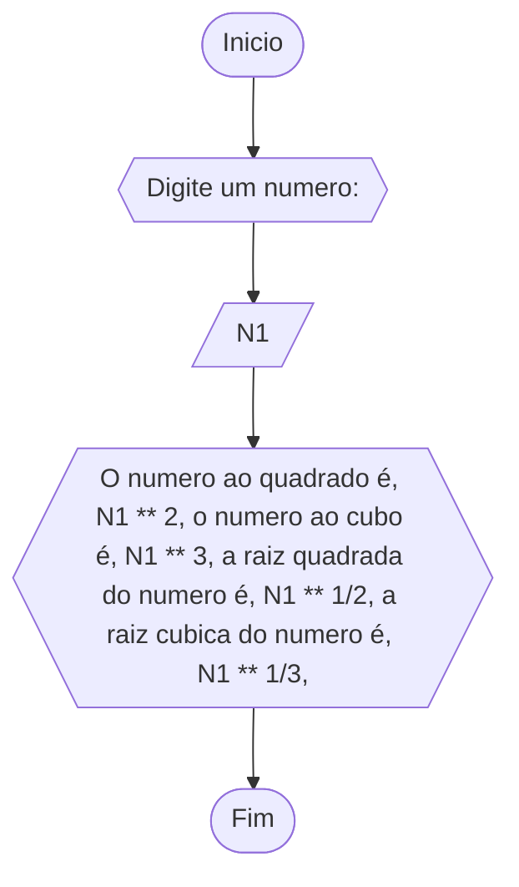
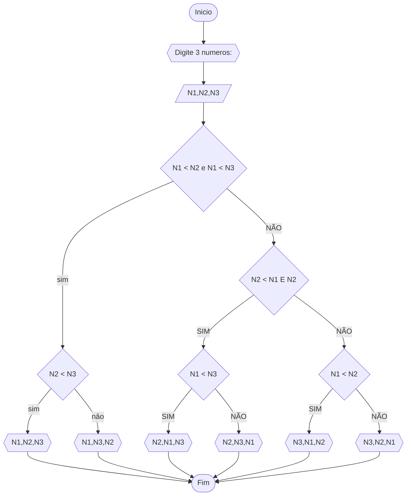
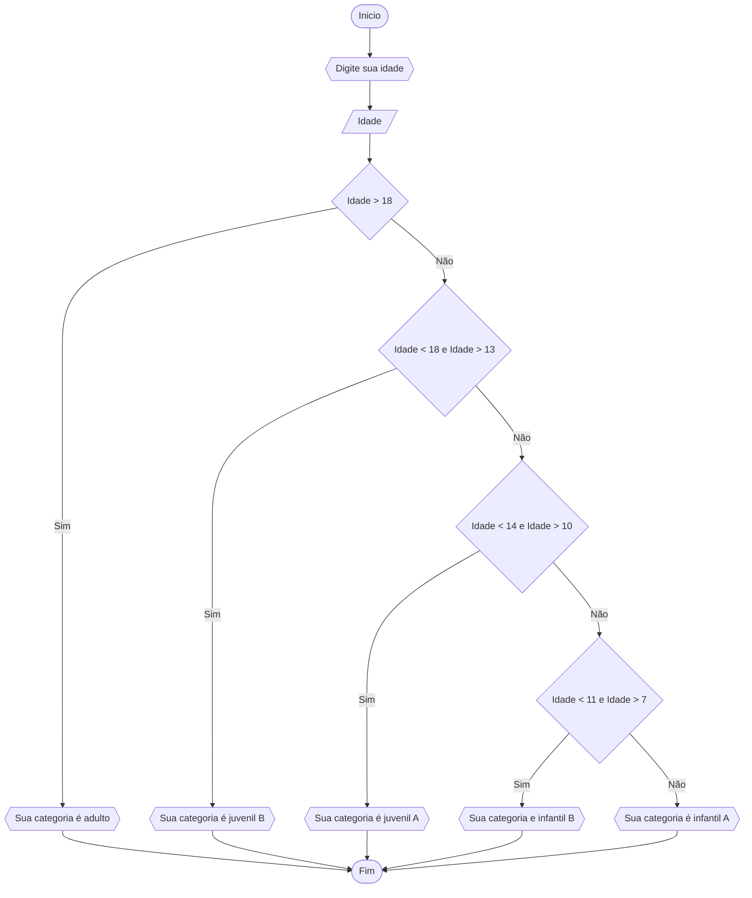
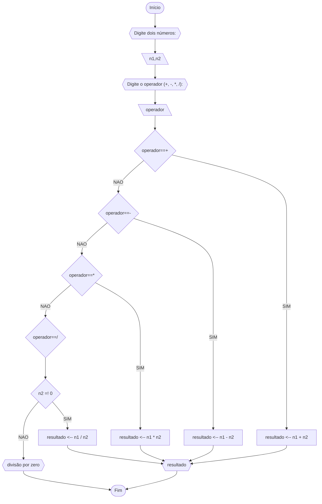

### QUESTÃO 1


```

1 AGORITMO Media
2 DECLARE N1,N2,N3,N4,Media : int
3 ESCREVA "Digite quatros numeros: "
4 LEIA N1,N2,N3,N4
5 Media = (N1+N2+N3+N4)/4
6 ESCREVA Media
7 FIM_ALGORITMO

```
### QUESÃO 2


```
1 ALGORITMO CONVERSAO_GRAUS
2 DECLARE Cel, Fah : reais
3 ESCREVA "DIGITE A TEMPERATURA EM CELCIUS: "
4 LEIA Cel
5 Fah = (9/5) * Cel + 32 
6 ESCREVA "ESTA", Cel,"GRAUS E ", Fah,"EM FAHRNHEIT" 
7 FIM_ALGORITMO


```
### QUESTÃO 3


```
1 ALGORITMO CHUVA
2 DECLARE Pol ,Mili : reais
3 ESCREVA "DIGITE AS POLEGADAS: "
4 LEIA Pol
5 Mili = Pol * 25.4
6 ESCREVA "TEM ", Mili, "milimetros de chuva" 
7 FIM_ALGORITMO


```

### QUESTÃO 4


```
1 ALGORITMO PREÇO_CARRO
2 DECLARE Cus_fabri, Cus_consu : reais
3 ESCREVA: "digite o custo de fabrica do carro: "
4 LEIA Cus_fabri
5 Cus_consu = Cus_fabri + (Cus_fabri * 0,12) + (Cus_fabri * 0,45)
6 ESCREVA "O custo do carro foi ", Cus_consu, " reais" 
7 FIM ALGORITMO

```
### QUESTÃO 5

```
1 ALGORITMO NUMERO_AO_QUADRADO
2 DECLARE num : real
3 ESCREVA "Digite um numero: "
4 LEIA num
5 ESCREVA"Numero ", num," ao quadrado é ",num ** 2
6 FIM_ALGORITMO
```
### QUESTÃO 6


```
1 ALGORITMO CONTA
2 DECLARE Ham,Cheese,Fritas,Milk,Refri,Total: numericos e reais
3 ESCREVA" Digite quantos hambugues, cheeseburgue, fritas, refri e milkshake foram consumidas"
4 LEIA Ham, Cheese, Fritas, Refri, Milk
5 Total = (Ham * 3) + (Cheese * 2.5) + (Fritas * 2.5) + (Refri * 2.5) + (Milk * 3)
6 ESCREVA "A conta deu ", total, " reais
7 FIM_ALGORITMO

```

### QUESTÃO 7


```
1 ALGORITMO SALARIO
2 DECLARE Nome : STRING
3 DECLARE total, Num_carros, Valor_vendas : numerico
4 ESCREVA "Digite o nome, o numero de carros vendidos e o valor total das vendas"
5 LEIA Nome, Num_carros, Valor_vendas
6 total = 500 + (Num_carros * 50 ) + (Valor_vendas * 0.05)
7 ESCREVA "O salario do funcionario", nome," é de ", total," reais"
8 FIM_ALGORITMO
```

### QUESTÃO 8

```
1 ALGORITMO MEDIA
2 DECLARE Nome : STRING
3 DECLARE Media, N1, N2 : NUMERICO
4 ESCREVA" Digite o nome do aluno, nota da prova e a nota qualitativa"
5 LEIA Nome, N1, N2
6 Media = (N1*2 + N2)/3
7 ESCREVA" A media do aluno ", Nome," foi ", media 
8 FIM_ALGORITMO

```

### QUESTÃO 9

```
1 ALGORTIMO DADOS_DE_ALUNO
2 DECLARE Nome, Email, Curso: STRING
3 DECLARE Matricula, Idade: NUMERICO
4 ESCREVA "Digite seu nome, curso e email"
5 LEIA Nome, Email, Curso
6 ESCREVA "Digite sua matricula e sua idade"
7 LEIA Matricula, Idade
8 ESCREVA "Os dados do aluno Nome: ", Nome," sua matricula: ", Matricula," seu curso: ", Curso," sua idade: ", Idade," e o emai: ", Email  
9 FIM_ALGORITMO
```
### QUESTÃO 10


```
1 ALGORITMO RAIO
2 DECLARE Raio, Area, Peri : NUMERICO
3 ESCREVA "Digite o raio "
4 LEIA Raio
5 Area = (Raio ** 2) * 3.14
6 Peri = 2 * 3.14 * Raio
7 ESCREVA "A area é ",Area," e o perimetro é ", Peri
8 FIM_ALGORITMO


```

### QUESTÃO 11


```
1 ALGORITMO RAIZ_E_EXPOENTE
2 DECLARE N1
3 ESCREVA "Digite um numero: "
4 LEIA N1 
5 ESCREVA "O numero ao quadrado é ", N1 ** 2, " o numero ao cubo é ", N1 ** 3, " a raiz quadrada do numero é ", N1 ** 1/2, " a raiz cubica do numero é ", N1 ** 1/3
6 FIM_ALGORITMO
 ```
### QUESTÃO 12


```
1 ALGORITMO ORDENAÇÃO
2 DECLARE N1, N2, N3: NUMERICO
3 ESCREVA "Digite 3 numeros: "
4 LEIA N1, N2, N3
5 SE N1 < N2 E N1 < 3
6 		ENTÃO SE N2 < N3
7 				ENTÃO ESCREVA "N1,N2,N3"
8 			   SENÃO
9 					  ESCREVA "N1,N3,N2"
10 SENÃO SE N2 < N1 E N2 < N3
11 		ENTÃO SE N1 < N3
12 				ENTÃO ESCREVA "N2,N1,N3"
13			  SENÃO 
14               ESCREVA " N2,N3,N1"
15 SENÃO SE N1 < N2
16 	         ENTÃO ESCREVA " N3,N1,N2"
17 		 SENÃO 
18			 ESCREVA "N3,N2,N1"
19 FIM_ALGORITMO		
```
### QUESTÃO 13


```
1 	ALGORITMO CATEGORIA
2 	DECLARE Idade : numerico
3 	SE Idade > 18
4 		ENTAO ESCREVA "Sua categoria é adulto"
5 	SENAO SE Idade < 18 e > 13
6 			ENTÃO ESCREVA"Sua categoria é juvenil B"
7 	SENAO SE IDADE < 14 e Idade > 10
8 			ENTÃO ESCREVA"Sua categoria é juvenil A"
9 	SENAO SE Idade < 11 E Idade > 7
10 			ENTÃO ESCREVA"Sua categoria é infantil B"
11 	SENAO 
12 			ESCREVA"Sua categoria é infantil A"
13 	FIM_ALGORITMO
```
### QUESTÃO 14

### Pseudocódigo
```
	ALGORITMO calculadora_simples
	DECLARE n1, n2, resultado: float
	DECLARE operador, +, -, *, / : operadores
		INICIO
			ESCREVA "Digite dois números e uma operação:"
			LEIA n1, n2, operador
			SE operador ← + ENTAO
				resultado == n1 + n2
			FIM_SE
			SE operador ← - ENTAO
				resultado == n1 - n2
			FIM_SE
			SE operador ← * ENTAO
				resultado == n1 * n2
			FIM_SE
			ENQUANTO operador ← / e n2 = 0 FAÇA
				ESCREVA "ERRO: divisão por zero"
			FIM_ENQUANTO
			SE operador ← / e n2 =! 0 ENTAO
				resultado == n1 / n2
			FIM_SE
			LEIA resultado
			ESCREVA resultado
		FIM
```
