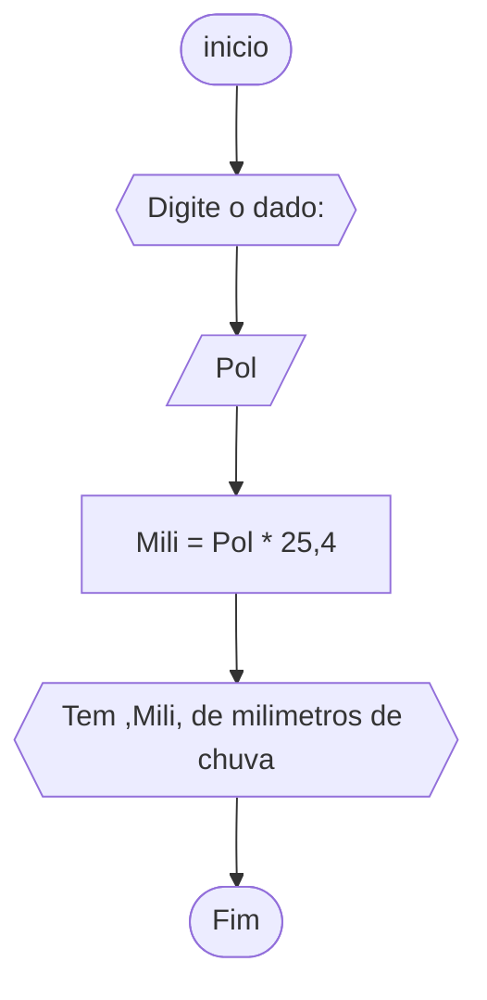
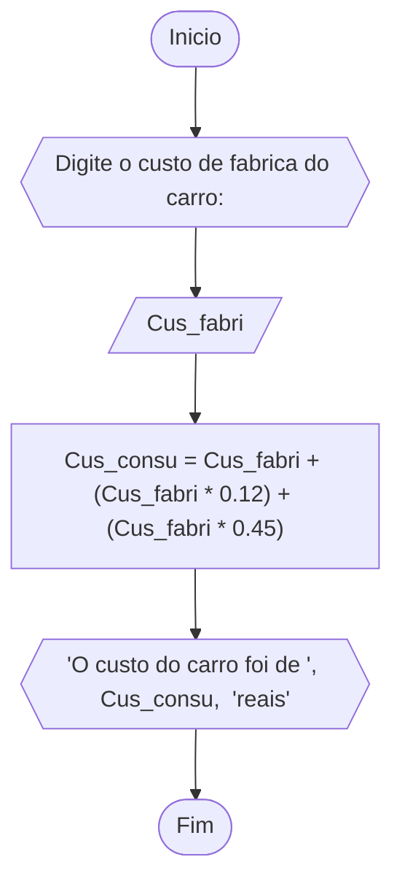
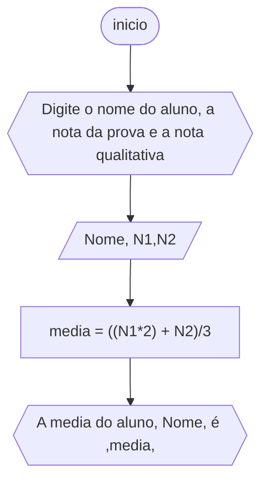

### QUESTÃO 1


```

1 AGORITMO Media
2 DECLARE N1,N2,N3,N4,Media : int
3 ESCREVA "Digite quatros numeros: "
4 LEIA N1,N2,N3,N4
5 Media = (N1+N2+N3+N4)/4
6 ESCREVA Media
7 FIM_ALGORITMO

```


```
1 ALGORITMO CONVERSAO_GRAUS
2 DECLARE Cel, Fah : reais
3 ESCREVA "DIGITE A TEMPERATURA EM CELCIUS: "
4 LEIA Cel
5 Fah = (9/5) * Cel + 32 
6 ESCREVA "ESTA", Cel,"GRAUS E ", Fah,"EM FAHRNHEIT" 
7 FIM_ALGORITMO


```



```
1 ALGORITMO CHUVA
2 DECLARE Pol ,Mili : reais
3 ESCREVA "DIGITE AS POLEGADAS: "
4 LEIA Pol
5 Mili = Pol * 25.4
6 ESCREVA "TEM ", Mili, "milimetros de chuva" 
7 FIM_ALGORITMO


```




```
1 ALGORITMO PREÇO_CARRO
2 DECLARE Cus_fabri, Cus_consu : reais
3 ESCREVA: "digite o custo de fabrica do carro: "
4 LEIA Cus_fabri
5 Cus_consu = Cus_fabri + (Cus_fabri * 0,12) + (Cus_fabri * 0,45)
6 ESCREVA "O custo do carro foi ", Cus_consu, " reais" 
7 FIM ALGORITMO

```

```
1 ALGORITMO NUMERO_AO_QUADRADO
2 DECLARE num : real
3 ESCREVA "Digite um numero: "
4 LEIA num
5 ESCREVA"Numero ", num," ao quadrado é ",num ** 2
6 FIM_ALGORITMO
```


```
1 ALGORITMO CONTA
2 DECLARE Ham,Cheese,Fritas,Milk,Refri,Total: numericos e reais
3 ESCREVA" Digite quantos hambugues, cheeseburgue, fritas, refri e milkshake foram consumidas"
4 LEIA Ham, Cheese, Fritas, Refri, Milk
5 Total = (Ham * 3) + (Cheese * 2.5) + (Fritas * 2.5) + (Refri * 2.5) + (Milk * 3)
6 ESCREVA "A conta deu ", total, " reais
7 FIM_ALGORITMO

```


```
1 ALGORITMO SALARIO
2 DECLARE Nome : STRING
3 DECLARE total, Num_carros, Valor_vendas : numerico
4 ESCREVA "Digite o nome, o numero de carros vendidos e o valor total das vendas"
5 LEIA Nome, Num_carros, Valor_vendas
6 total = 500 + (Num_carros * 50 ) + (Valor_vendas * 0.05)
7 ESCREVA "O salario do funcionario", nome," é de ", total," reais"
8 FIM_ALGORITMO
```



```
1 ALGORITMO MEDIA
2 DECLARE Nome : STRING
3 DECLARE Media, N1, N2 : NUMERICO
4 ESCREVA" Digite o nome do aluno, nota da prova e a nota qualitativa"
5 LEIA Nome, N1, N2
6 Media = (N1*2 + N2)/3
7 ESCREVA" A media do aluno ", Nome," foi ", media 
8 FIM_ALGORITMO

```

```mermaid
flowchart TD


```
