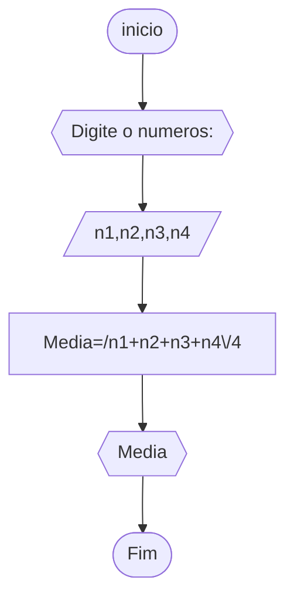
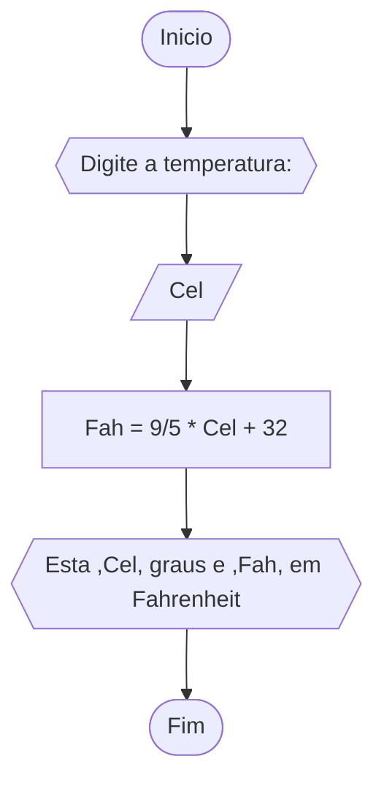
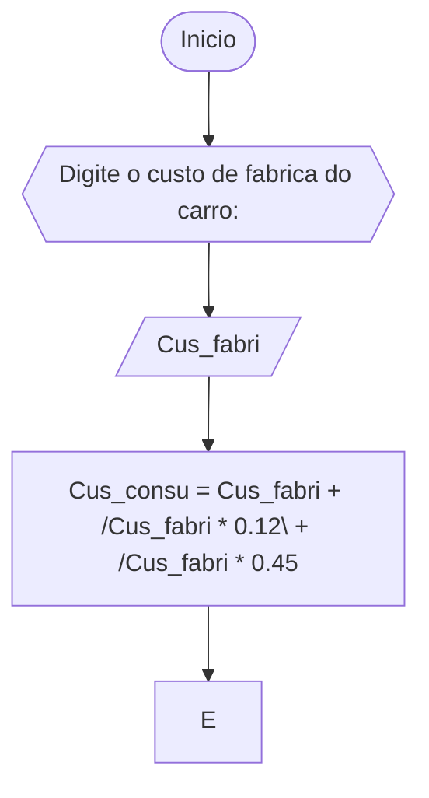

### QUESTÃO 1


```

1 AGORITMO Media
2 DECLARE N1,N2,N3,N4,Media : int
3 ESCREVA "Digite quatros numeros: "
4 LEIA N1,N2,N3,N4
5 Media = (N1+N2+N3+N4)/4
6 ESCREVA Media
7 FIM_ALGORITMO

```



```
1 ALGORITMO CONVERSAO_GRAUS
2 DECLARE Cel, Fah : reais
3 ESCREVA "DIGITE A TEMPERATURA EM CELCIUS: "
4 LEIA Cel
5 Fah = (9/5) * Cel + 32 
6 ESCREVA "ESTA", Cel,"GRAUS E ", Fah,"EM FAHRNHEIT" 
7 FIM_ALGORITMO


```


```
1 ALGORITMO CHUVA
2 DECLARE Pol ,Mili : reais
3 ESCREVA "DIGITE AS POLEGADAS: "
4 LEIA Pol
5 Mili = Pol * 25.4
6 ESCREVA "TEM ", Mili, "milimetros de chuva" 
7 FIM_ALGORITMO


```


