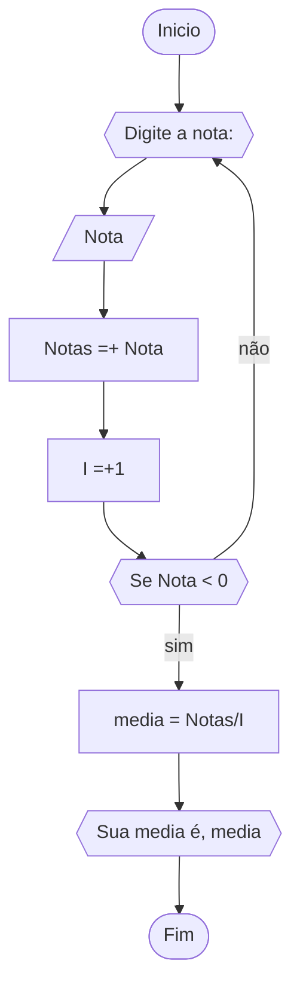

```
1 	ALGORITMO PAR_IMPAR
2 	DECLARE N1
3 	ESCREVA"Digite um numero: "
4 	LEIA N1
5 	ENQUANTO N1 < 0 FAÇA
6 		ESCREVA"DIGITE UM NUMERO:"
7		LEIA N1
8	FIM_ENQUANTO
9	SE N1 % 2 == 0
10		ENTÃO ESCREVA"NUMERO PAR"
11	SENÃO
12		ESCREVA"NUMERO IMPAR"
13	FIM_ALGORITMO

```


```
1 	ALGORITMO MULTIPLO_DE_3
2	DECLARE I: NUMERICO INTEIRO
3	PARA I DE 0 ATE 30 PASSO 3
4 		ESCREVA(I)
5 	FIM_PARA
6	FIM_ALGORITMO

```



```
1 	ALGORITMO_NOTAS
2 	DECLARE Notas, Nota, Media, i : numerico
3   REPITA
4 	  ESCREVA"Digite a nota:"
5  	  LEIA Nota
6	    Notas =+ Nota
7	    i =+ 1
8 	ATE_QUE Nota < 0
9		media = Notas/i
10	  ESCREVA"Sua media é", media
11	FIM_ALGORITMO
```
