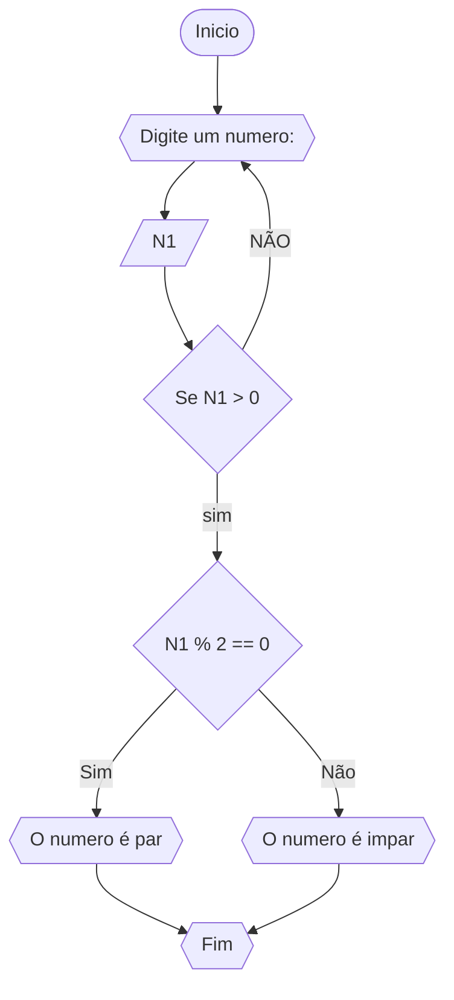
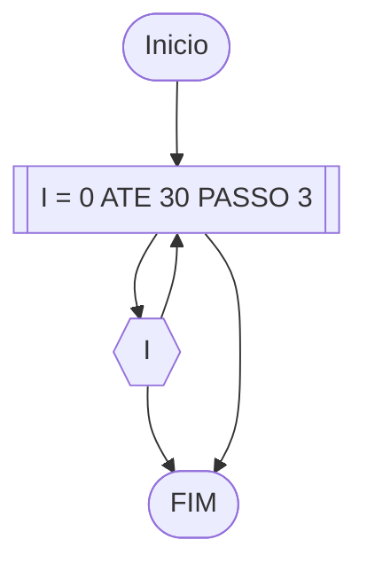

### QUESTÃO 1


```
1 	ALGORITMO PAR_IMPAR
2 	DECLARE N1
3 	ESCREVA"Digite um numero: "
4 	LEIA N1
5 	ENQUANTO N1 < 0 FAÇA
6 		ESCREVA"DIGITE UM NUMERO:"
7		LEIA N1
8	  FIM_ENQUANTO
9	  SE N1 % 2 == 0
10		ENTÃO ESCREVA"NUMERO PAR"
11	SENÃO
12		ESCREVA"NUMERO IMPAR"
13	FIM_ALGORITMO

```

```
| N1 | N1 < 0  | N1 % 2 == 0 | Saída |
| -- | -- | -- | -- | -- | 
| -1 | V |   | "Digite um numero: " |
| 0  | F | V | "O número é par!" |
| 13 | F | F | "O número é impar!" |
| 30 | F | V | "O número é par!" |
```
### QUESTÃO 2



```
1 	ALGORITMO MULTIPLO_DE_3
2	DECLARE I: NUMERICO INTEIRO
3	PARA I DE 0 ATE 30 PASSO 3
4 		ESCREVA(I)
5 	FIM_PARA
6	FIM_ALGORITMO

```
```
| N | I | PASSO 3 | Saída |
| -- | -- | -- | -- | -- | 
| 30 | 0 | + 3 | 0 |
| 30 | 3 | + 3 |  3 |
| 30 | 6 | + 3 |  6 |
| 30 | 9 | + 3 | 9  |
|...|...|...|...
|30|30| 0|30
```
### QUESTÃO 3
```mermaid
flowchart TD
A([Inicio]) --> B{{Digite um numero}}
B --> C[/N/]
C --> D [I = 0]
D --> E{{digite um numero}}
E --> F[/Num/]
F -->G [total =+ Num]
G --> H{Se I == N}
H -->|Sim|I{{O total dos numeros foi,total}}
I --> Z([Fim])
H -->|não| E
```

```
1 	ALGORITMO SOMA
2 	DECLARE Num, total, N, I : inteiro e numerico
3   ESCREVA" DIGITE O LIMETE DA SEQUENCIA"
4   LEIA N
5   I = 0
6 	REPITA
7		ESCREVA"Digite um numero"
8		LEIA Num
9		total =+ Num
10      I =+ 1
7	ATE_QUE I == N
8	ESCREVA"A soma total deu ", total
9	FIM_ALGORITMO
```
```
| Num | total =+ Num | Num == 0 | Saída |
| -- | -- | -- | -- | -- | 
| 3 | 3 | F  |  |
| 9  | 12 | F |  |
| 13 | 25 | F |  |
| 0 | 25 | V | "O total é 25" |
```
### QUESTÃO 4


```
1  ALGORITMO_NOTAS
2  DECLARE Notas, Nota, Media, i : numerico
3  REPITA
4    ESCREVA" Digite uma nota:"
5    LEIA Nota
6    Notas =+ Nota
7    i =+ 1
8  ATE_QUE Nota < 0
9  Media = Notas/i
10 ESCREVA" Sua media é ", Media
11 FIM_ALGORITMO
```
